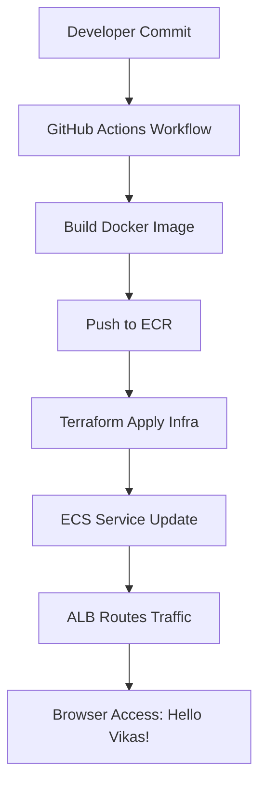
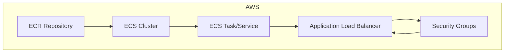

# AWS Infra Deploy CI/CD 🚀

End-to-end CI/CD pipeline using **GitHub Actions → ECR → ECS → ALB → Terraform**.  
This repo demonstrates enterprise-grade automation, reproducibility, and governance.

---

## 📂 Repo Structure
- `.github/workflows/ci-cd.yml` → CI/CD pipeline
- `terraform/` → Infrastructure (ECS, ALB, SGs, outputs)
- `app/` → Flask demo app
- `scripts/deploy.sh` → ECS deploy script
- `LoadBalancer-CICD-Policy.json` → IAM policy

---

## ⚙️ Setup Instructions

### 1. Prerequisites
- AWS account with IAM user `github-actions-user`
- Policies:
  - `AmazonECRFullAccess`
  - `AmazonECS_FullAccess`
  - `CloudWatchFullAccess`
  - `ElasticLoadBalancingFullAccess`
  - Custom `LoadBalancer-CICD-Policy`
- GitHub Secrets:
  - `AWS_ACCESS_KEY_ID`
  - `AWS_SECRET_ACCESS_KEY`
  - `AWS_REGION`

---

### 2. Clone & Configure
```bash
git clone https://github.com/vikas-wanchoo-devops/AWS-Infra-Deploy-CICD.git
cd AWS-Infra-Deploy-CICD
```

---

### 3. Run Pipeline
Push code to `main` or `dev` branch → GitHub Actions triggers automatically.

#### Workflow Steps:
- Build Docker image
- Push image to ECR
- Terraform apply (provision infra)
- ECS service update (deploy new task)

---

### 4. Verify Deployment

Terraform output example:
```bash
alb_dns_name = assaabloy-app-alb-373654538.eu-north-1.elb.amazonaws.com
```

Open in browser:
```bash
http://<alb_dns_name>
```

#### Expected Response:
```bash
Hello Vikas from Assa Abloy DevOps Pipeline!
```

---

## 📊 Outputs
- **ECR Repo URL** → Docker image storage
- **ECS Cluster/Service Name** → Deployment reference
- **ALB DNS Name** → Application access
- **ALB ARN / Target Group ARN** → Automation hooks
- **ECS Task Security Group ID** → Debugging & audit

---

## 🛠️ Troubleshooting

**Rollback issues**
- Ensure ECS task SG allows inbound traffic from ALB SG

**Health check failures**
- Verify `/health` endpoint returns HTTP 200

**Terraform errors**
- Ensure S3 backend bucket exists and versioning is enabled

---

## 📌 Next Steps
- Add HTTPS using ACM + custom domain *(optional, may incur cost)*
- Enable ECS auto-scaling for better load handling
- Integrate monitoring with CloudWatch / Grafana

---

## 🔄 CI/CD Flow Diagram


---

## 🏗️ Terraform Infra Architecture


---

## 💡 Notes
- Designed for **modular Terraform deployments**
- Follows **immutable infrastructure principles**
- Fully compatible with **GitHub Actions CI/CD workflows**

---

## 🤝 Contributing
Feel free to fork, raise issues, or submit PRs to improve the pipeline.

---

## 📜 License
MIT License
